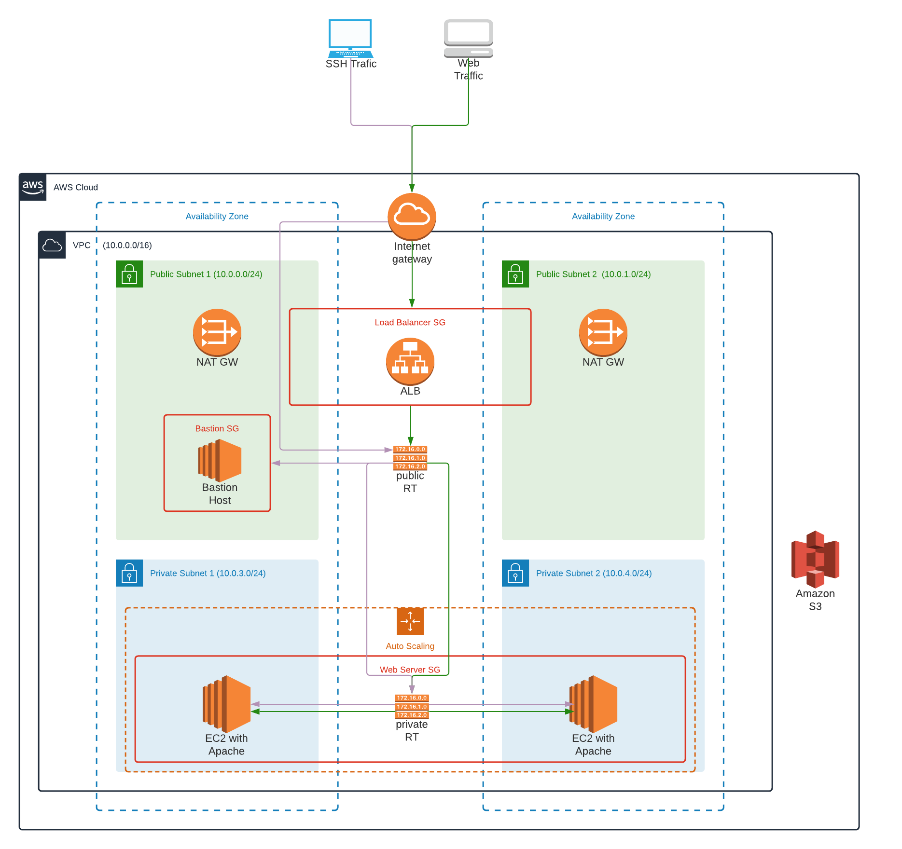

# Create Stack
* ./create.sh udemy-infra-stack private-network.yml private-network-parameters.json
* ./create.sh udemy-HA-stack ha-infrastructure.yml ha-infrastructure-parameters.json
* ./create.sh udemy-bastion-host-stack bastion-host.yml ha-infrastructure-parameters.json

# Update Stack
* ./update.sh udemy-infra-stack private-network.yml private-network-parameters.json
* ./update.sh udemy-HA-stack ha-infrastructure.yml ha-infrastructure-parameters.json
* ./update.sh udemy-bastion-host-stack bastion-host.yml ha-infrastructure-parameters.json

# Delete Stack
* ./delete.sh udemy-bastion-host-stack
* ./delete.sh udemy-HA-stack
* ./delete.sh udemy-infra-stack

### Diagram

SSH into EC2
ssh -i EC2-KP.pem ec2-user@YOUR_IP

The following AWS components are deployed and configured as part of our CloudFormation template

A VPC configured with public and private subnets across three Availability Zones.
One Elastic Load Balancer (ELB) attached to VPC to access the admin portal.
In the public subnets, NAT gateways to allow outbound internet connectivity for resources (YugaByte instances) in the private subnets.
We could add network ACLs to only allow outbound connections to specific domains - but depends on the needs of customers too.
In the public subnets, bastion hosts are in an Auto Scaling Group (ASG) with Elastic IP addresses to allow inbound Secure Shell (SSH) access. One bastion host is deployed by default.
Security groups to enable communication within the VPC and to restrict access to only necessary protocols and ports.
In the private subnets, a YugaByte DB cluster with the replication factor set to three.
One EC2 instance of c5.2xlarge in each availability zone, with 250Gb of EBS volume attached to it. (instance type and volume size can be made configurable)
Custome Script to install and configure YugaByte DB component of the version defined by the user or by default 1.2.8.0. The script will configure and run the master server and tserver as demon service on all ec2 instances.

# Security
Application instances are isolated in the private subnets. By configuring the corresponding security groups, inbound traffic is exclusively allowed from Bastion hosts, through Secure Shell Access (SSH) on port 22 and the Elastic Load Balancing, HTTP and HTTPS traffic on ports 80 and 443. 